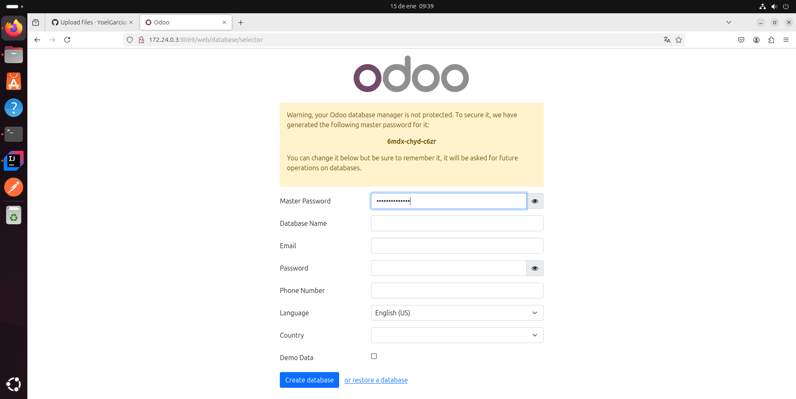
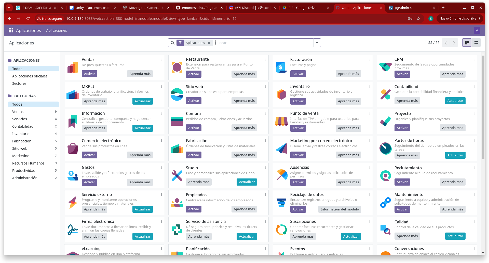
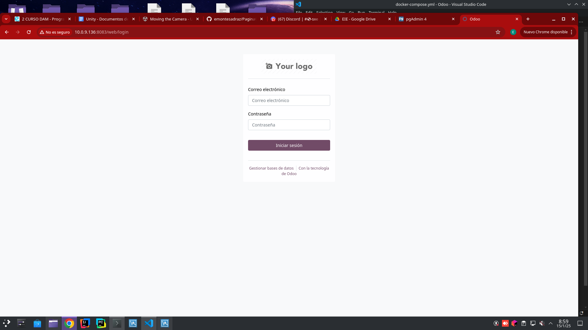

# Tarea 10 - Instalación Odoo 17 y PgAdmin

*Esteban Miguel Montes Adraz* - *2º DAM* - *SXE*

Este es el docker compose con el que trabajaremos las dos instalaciones.
```yml
sservices:
  web:
    image: odoo:17.0 # Imagen de Odoo 
    depends_on:
      - db  # Dependemos del contenedor db
    ports:
      - "8083:8069"
  db:
    image: postgres:15 # Imagen de Postgres
    environment:
      - POSTGRES_DB=postgres  # Nombre de la base de datos
      - POSTGRES_PASSWORD=odoo # Contraseña de la base de datos
      - POSTGRES_USER=odoo # Usuario de la base de datos
  pgadmin:
    image: dpage/pgadmin4 # Imagen de PgAdmin
    container_name: pgadmin4_container # Nombre del contenedor
    restart: always # Aqui estamos indicando que el contenedor se reinicie siempre
    ports:
      - "8888:80" # Aqui estamos indicando el puerto por el cual se accedera a PgAdmin
    environment:
      PGADMIN_DEFAULT_EMAIL: user-name@domain-name.com
      PGADMIN_DEFAULT_PASSWORD: strong-password
    volumes:
      - pgadmin-data:/var/lib/pgadmin 
volumes:
  pgadmin-data:
  ```

Vamos a empezar por la instalación de Odoo.

### 1. PASOS A SEGUIR
Lo primero de todo, para tenerlo todo más ordenado, vamos a crear una carpeta llamada "Odoo" para posteriormente meternos dentro y crear el archivo ```docker-compose.yml```
```bash
mkdir Odoo
cd Odoo
nano docker-compose.yml
```
Luego copiamos y pegamos el docker compose dado anteriormente, lo guardamos y pondremos en nuestra terminal el comando ```docker compose up -d``` para iniciar el contenedor.
Una vez seguidos estos pasos iniciales podemos empezar con la configuración de nuestro Odoo.
## ODOO
### 1. Como buscar nuestra página de Odoo
Para empezar, pondremos en nuestro buscador nuestra ip (si utilizamos adaptador puente) o ```localhost (si estamos con NAT) acompañado del puerto donde se accederá a nuestro Odoo. Tendremos que poner algo así:

Si tenemos nuestra conexión en Adaptador Puente
```bash
[Ip de tu dispositivo]:8083
```

Si tenemos nuestra conexión en NAT
```bash
localhost:8083
```
Una vez puesto correctamente nuestra ip, deberíamos entrar a este sitio web:


Pasamos al segundo paso.

### 2. Registrarnos
Este paso no es mucho más allás, en la pantalla de registro de Odoo vamos rellenando los campos. Podemos cambiar la "Master password" a la contraseña que queramos.
Una vez terminado el registro, le damos al botón de "Create Database"
Una vez hecho esto ya podremos entrar libremente con nuestro usuario a nuestra página de Odoo


Ahora si nos salimos y volvemos a entrar nos saldrá esta página de inicio de sesion 

Donde solo vamos a poner el correo electrónico y la contraseña con la que nos registramos.
