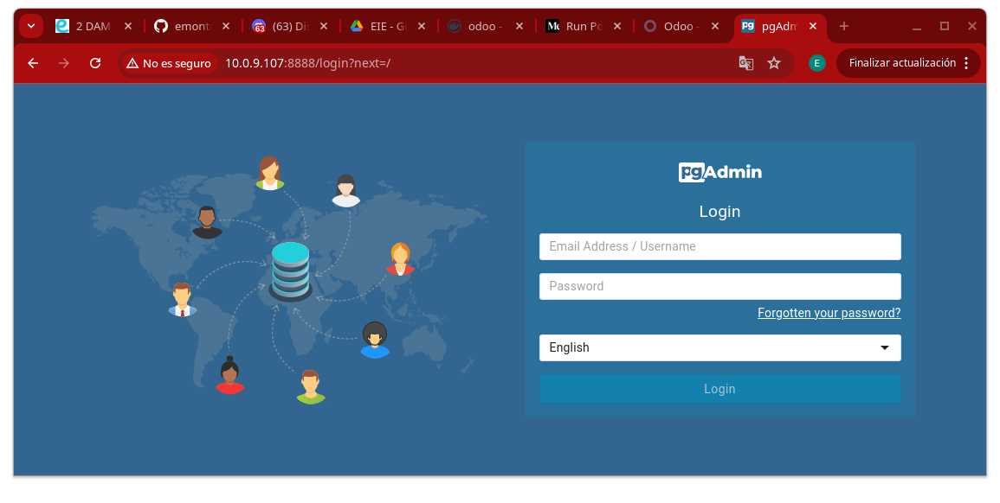

# Tarea 10 - Instalación Odoo 17 y PgAdmin

*Esteban Miguel Montes Adraz* - *2º DAM* - *SXE*

Este es el docker compose con el que trabajaremos las dos instalaciones.
```yml
sservices:
  web:
    image: odoo:17.0 # Imagen de Odoo 
    depends_on:
      - db  # Dependemos del contenedor db
    ports:
      - "8083:8069"
  db:
    image: postgres:15 # Imagen de Postgres
    environment:
      - POSTGRES_DB=postgres  # Nombre de la base de datos
      - POSTGRES_PASSWORD=odoo # Contraseña de la base de datos
      - POSTGRES_USER=odoo # Usuario de la base de datos
  pgadmin:
    image: dpage/pgadmin4 # Imagen de PgAdmin
    container_name: pgadmin4_container # Nombre del contenedor
    restart: always # Aqui estamos indicando que el contenedor se reinicie siempre
    ports:
      - "8888:80" # Aqui estamos indicando el puerto por el cual se accedera a PgAdmin
    environment:
      PGADMIN_DEFAULT_EMAIL: user-name@domain-name.com
      PGADMIN_DEFAULT_PASSWORD: strong-password
    volumes:
      - pgadmin-data:/var/lib/pgadmin 
volumes:
  pgadmin-data:
  ```

Vamos a empezar por la instalación de Odoo.

### 1. PASOS A SEGUIR
Lo primero de todo, para tenerlo todo más ordenado, vamos a crear una carpeta llamada "Odoo" para posteriormente meternos dentro y crear el archivo ```docker-compose.yml```
```bash
mkdir Odoo
cd Odoo
nano docker-compose.yml
```
Luego copiamos y pegamos el docker compose dado anteriormente, lo guardamos y pondremos en nuestra terminal el comando ```docker compose up -d``` para iniciar el contenedor.
Una vez seguidos estos pasos iniciales podemos empezar con la configuración de nuestro Odoo.
## ODOO
### 1. Como buscar nuestra página de Odoo
Para empezar, pondremos en nuestro buscador nuestra ip (si utilizamos adaptador puente) o ```localhost (si estamos con NAT) acompañado del puerto donde se accederá a nuestro Odoo. Tendremos que poner algo así:

Si tenemos nuestra conexión en Adaptador Puente
```bash
[Ip de tu dispositivo]:8083
```

Si tenemos nuestra conexión en NAT
```bash
localhost:8083
```
Una vez puesto correctamente nuestra ip, deberíamos entrar a este sitio web:


Pasamos al segundo paso.

### 2. Registrarnos
Este paso no es mucho más allás, en la pantalla de registro de Odoo vamos rellenando los campos. Podemos cambiar la "Master password" a la contraseña que queramos.
Una vez terminado el registro, le damos al botón de "Create Database"
Una vez hecho esto ya podremos entrar libremente con nuestro usuario a nuestra página de Odoo


Ahora si nos salimos y volvemos a entrar nos saldrá esta página de inicio de sesion 

Donde solo vamos a poner el correo electrónico y la contraseña con la que nos registramos.
## PG ADMIN
### 1. Registrarnos en Pg Admin
Ahora empezaremos con la instalación de PG Admin. Para buscar nuestra página de PG Admin haremos algo muy parecido a cuando buscamos la de Odoo.

Si nuestra conexión es de tipo Adaptador Puente
```bash
[Ip del dispositivo]:8888
```

Si nuestra conexión es de tipo NAT
```bash
localhost:8888
```

Una vez busquemos esto entraremos en esta página

Aquí pondremos el email y la contraseña que hemos proporcionado en nuestro docker-compose

Más concretamente esta parte del contenedor de PG Admin (el email y la contraseña dados son de ejemplo, aquí pon tu contraseña y el correo que desees)
```yml
environment:
      PGADMIN_DEFAULT_EMAIL: user-name@domain-name.com
      PGADMIN_DEFAULT_PASSWORD: strong-password
```

Una vez introducido el correo y la contraseña correctamente entraremos a nuestro Pg Admin

Ahora vamos a añadir nuestro servidor

### 2. Añadir servidor
Para este paso tendremos que darle a "Añadir Nuevo Servidor" y nos saldrá esta pestaña

Nos saldrá el "Nombre" vacío. Le ponemos el nombre que queramos para nuestro servidor. 
Una vez hecho esto, vamos a la pestaña de "Conexión" y nos aparecerá esto


Ahora prestad mucha atención a los pasos a seguir para rellenar la Direccion de servidor
 1. Iremos a nuestra terminal y pondremos el siguiente comando
    ```bash
    sudo docker ps -a
    ```
    Una vez ejecutado nos saldrá esto, buscamos el ID de nuestra imagen de postgres, tal cual aparece en la imagen
    
2. Copiamos el ID y pondremos el siguiente código
    ```bash
    sudo docker inspect [ID]
    ```
    Y copiaremos la IP Address, que es lo que tendremos que pegar en Direccion del servidor
    
3. Después de pegar la Direccion de servidor, ponemos el nobre de usuario y la contraseña que tenemos en nuestro docker compose
    ```yml
    db:
    image: postgres:15 # Imagen de Postgres
    environment:
      - POSTGRES_DB=postgres  # Nombre de la base de datos
      - POSTGRES_PASSWORD=odoo # Contraseña de la base de datos
      - POSTGRES_USER=odoo # Usuario de la base de datos
    ```
    Y le damos a "Salvar"

Una vez hecho todos los pasos ya podremos acceder a nuestro servidor y controlarlo


Y listo, ya tendrías instalado Odoo y PG Admin configurado totalmente

# PREGUNTAS

## ¿Que ocurre si en el ordenador local el puerto 5432 está ocupado? ¿Y si lo estuviese el 8069? ¿Como puedes solucionarlo?
1. Si intento entrar al puerto 5432 estando ocupado, entraría a la instancia que ya tiene ese puerto ocupado, no a la que ya estoy creando. Para solucionarlo, podríamo ir al archivo ```postgresql.conf``` y cambiar la linea del puerto de "5432" a la que quieras.

2. Si el puerto 8069 está ocupado, directamente nuestro buscador no podrá establecer conexión con el puerto. Para solucionarlo en el ```docker-compose.yml``` cambiamos el puerto

ANTES
```yml
web:
    image: odoo:17.0 # Imagen de Odoo 
    depends_on:
      - db  # Dependemos del contenedor db
    ports:
      - "8069:8069"
```

DESPUÉS
```yml
web:
    image: odoo:17.0 # Imagen de Odoo 
    depends_on:
      - db  # Dependemos del contenedor db
    ports:
      - "8083:8069"
```